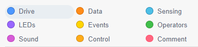
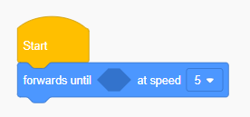
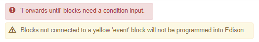

# edscratchczech
Browser plugin for Edison Edscratch with Czech localization. Works for three different versions of Edison Edscratch:

- [Edison Edscratch v3](https://www.edscratchapp.com/v3/)
- [Edison Edscratch v2](https://www.edscratchapp.com/v2/)
- ["Cloud" version of Edison Edscratch](https://cloud.edscratchapp.com/)

## How does it works?
There are two ways the plugin translates Edison Edscratch into Czech language.

The first one (file `translate_dom.js`) looks for HTML elements having specific class attribute set and replaces their content with Czech words. This translates top left navigation with block types. This file is needed for Edison Edscratch v2 and "cloud" version of Edison Edscratch.

The second one (file `block_rules.json`) replaces four JavaScript files downloaded to the browser as part of the Edison Edscratch application with their copy having texts translated into Czech. This translates the blocks and warning and error messages. This is needed for all Edison Edscratch versions.

## How to create your own Edison Edscratch translation plugin
To translate Edison Edscratch into your language:
1. In `translate_dom.js` file look at the `switch` statement and for each option replace Czech words assigned to `translation` variable with words in your language.
2. Download following original JavaScript files:
   - https://www.edscratchapp.com/v2/js/blockly_compressed_vertical.js
   - https://www.edscratchapp.com/v2/js/blocks_compressed_vertical.js
   - https://www.edscratchapp.com/v3/errorMessages.js
   - https://www.edscratchapp.com/v3/msg/messages.js
3. In `errorMessages.js` file translate string values in both `Blockly.redErrorMessages` and `Blocky.yellowErrorMessages` objects. In our plugin the translated file is saved as `errorMessages_czech.js`.
4. Translating blocks is bit more complicated.
   - For Edison Edscratch v2 and "cloud" version: Open [Edison Edscratch app](https://www.edscratchapp.com/v2/), go through all the block types and search block texts one by one in `blockly_compressed_vertical.js` and `blocks_compressed_vertical.js` files and translate them. In our plugin the translated files are also saved with `czech` suffix.
   - For Edison Edscratch v3: Open [Edison Edscratch app](https://www.edscratchapp.com/v3/), go through all the block types and search block texts one by one in `messages.js` and `blockly_compressed_vertical.js` files and translate them. The majority of texts is stored in `messages.js` file but options for a few combo boxes are still placed in the second file. In our plugin the translated files are also saved with `czech` suffix.
6. Save all translated JavaScript files, open `block_rules.json` file and replace `extensionPath` properties in all rules with path to your translated files.
7. Open `manifest.json` file, update plugin `name`, `version` and `description` and change `resources` in `web_accessible_resources` section to match paths of your translated JavaScript files.
8. Create your own tile and icon images.
